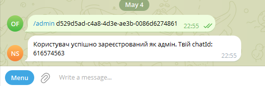

# Telegram Notification App
App to send notification to user via telegram bot.

# How to install

1. Copy AppScript google spreadsheet files from app_scripts directory. (How to use google app scripts: https://developers.google.com/apps-script/guides/sheets/functions) 
2. Replace 

```var url = "http://<REPLACE_BY_YOUR_IP>:<YOUR_PORT>/";``` 

with your IP address and application port. (It can be configured in **application.properties**, e.g. *server.port=8080*)

For example:

```var url = "http://195.23.62.122:8080/";```

3. Prepare executable jar

``` mvn clean package``` 

4. Create ***application.properties*** file
```angular2html
telegram.bot.user-name=<YOUR_TELEGRAM_BOT_NAME>
telegram.bot.token=<YOUR_TELEGRAM_BOT_TOKEN>
telegram.bot.admin-chat-ids=<YOUR_TELEGRAM_ADMIN_CHAT_IDS>
telegram.bot.admin-passphrase=<YOUR_TEGRAM_PASSPHRASE>
```
*** Important  Note:

How to get value for `telegram.bot.admin-chat-ids` you can find in [Features](#Features)  
# How to run
```java -jar target/telegram_notification-0.0.1-SNAPSHOT.jar```

# Features

#### Register your telegram account as admin for telegram bot

Admin account is able to receive register notifications once someone is registered in a system and linked landId 
with his telegram chatId.


1. Register your account by entering `/admin <YOUR_TEGRAM_PASSPHRASE>`, stored in ***application.properties*** file. 

For example:

in *application.properties*

`telegram.bot.admin-passphrase=d529d5ad-c4a8-4d3e-ae3b-0086d6274861`



2. Use your `chadId` from a registration response for your application.

For example:
`telegram.bot.admin-chat-ids=61657563`


